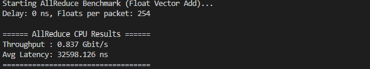

# settig up the environment
## pull the docker image
```bash
docker pull ghcr.io/spcl/pspin:latest
```
## run the container
```bash
docker run -v <host working dir>:<container working dir> -it ghcr.io/spcl/pspin:latest /bin/bash
```

## Source this file every time you want to run simulations
```bash
source sourceme-template.sh (remember to updade the path inside the script)
```

## verilate the hardware
```bash
cd hw/verilator_model/
make release
make debug
```

## compille the handlers and simulation driver and run!
```bash
cd examples/{workload}
make all
./sim_{workload} <args>
# you can use `--help` to see the available arguments
```

# expected output
